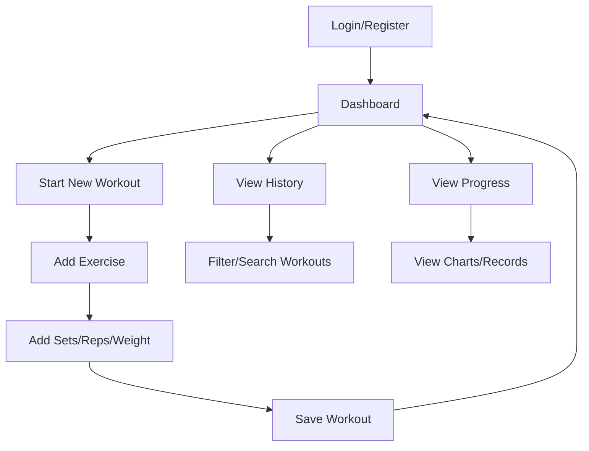

## 1. Product Overview
A web application for tracking gym workouts with detailed exercise logging. Users can record their daily workout sessions including exercises, sets, repetitions, and weights used. The app helps fitness enthusiasts maintain consistent workout records and track their progress over time.

Target users include gym-goers, personal trainers, and fitness enthusiasts who want to systematically track their strength training progress.

## 2. Core Features

### 2.1 User Roles
| Role | Registration Method | Core Permissions |
|------|---------------------|------------------|
| User | Email registration | Create, view, edit, delete own workout logs |

### 2.2 Feature Module
The gym workout tracker consists of the following main pages:
1. **Dashboard**: Overview of recent workouts, quick stats, and navigation to other sections
2. **Workout Log**: Add new workout entries with exercises, sets, reps, and weight
3. **History**: View and manage past workout sessions with filtering and search
4. **Progress**: Visual charts showing workout trends and personal records

### 2.3 Page Details
| Page Name | Module Name | Feature description |
|-----------|-------------|---------------------|
| Dashboard | Recent Workouts | Display last 5 workout sessions with date and exercise count |
| Dashboard | Quick Stats | Show total workouts this week, current streak, and favorite exercises |
| Dashboard | Quick Actions | Buttons to start new workout or view full history |
| Workout Log | Exercise Selection | Search and select from predefined exercise database |
| Workout Log | Set Management | Add multiple sets with reps and weight for each exercise |
| Workout Log | Save Workout | Save completed workout with timestamp and notes |
| History | Workout List | Chronological list of all past workouts with basic info |
| History | Filter & Search | Filter by date range, exercise type, or search by keywords |
| History | Workout Details | View complete workout breakdown with all sets and reps |
| History | Edit/Delete | Modify or remove existing workout entries |
| Progress | Charts | Line charts showing weight progression over time |
| Progress | Personal Records | Display best performances for each exercise |
| Progress | Export Data | Download workout data as CSV file |

## 3. Core Process
**User Flow:**
1. User registers/logs into the application
2. From dashboard, user clicks "Start New Workout"
3. User selects date and adds exercises with sets, reps, and weight
4. User saves the workout which gets stored in their history
5. User can view progress charts and personal records over time
6. User can search and filter through workout history

## 4. User Interface Design

### 4.1 Design Style
- **Primary Color**: Blue (#3B82F6) for main actions and headers
- **Secondary Color**: Gray (#6B7280) for secondary text and borders
- **Success Color**: Green (#10B981) for completed workouts and achievements
- **Button Style**: Rounded corners with subtle shadows on hover
- **Font**: Inter font family with 16px base size
- **Layout**: Card-based design with clean spacing and mobile-first approach
- **Icons**: Heroicons for consistent iconography

### 4.2 Page Design Overview
| Page Name | Module Name | UI Elements |
|-----------|-------------|-------------|
| Dashboard | Recent Workouts | Card layout with workout date, exercise count, and quick view button |
| Dashboard | Quick Stats | Horizontal stat cards with icons and numbers |
| Workout Log | Exercise Selection | Searchable dropdown with exercise categories |
| Workout Log | Set Management | Table format with editable fields for reps and weight |
| History | Workout List | Timeline view with collapsible workout details |
| Progress | Charts | Responsive line charts with date range selector |

### 4.3 Responsiveness
Mobile-first design approach with breakpoints at 640px, 768px, and 1024px. Touch-optimized interactions with larger tap targets on mobile devices. Cards stack vertically on mobile and arrange in grid on desktop.

### 4.4 Data Visualization
Charts use Chart.js with smooth animations and responsive design. Color-coded progress indicators with green for improvements and orange for plateaus. Interactive tooltips showing detailed workout information on hover.