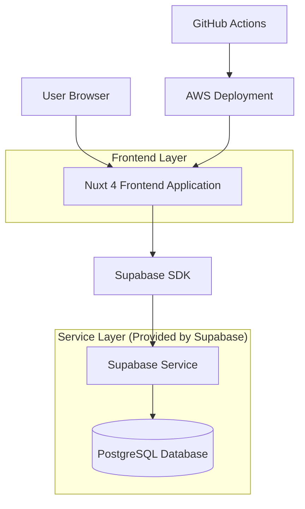
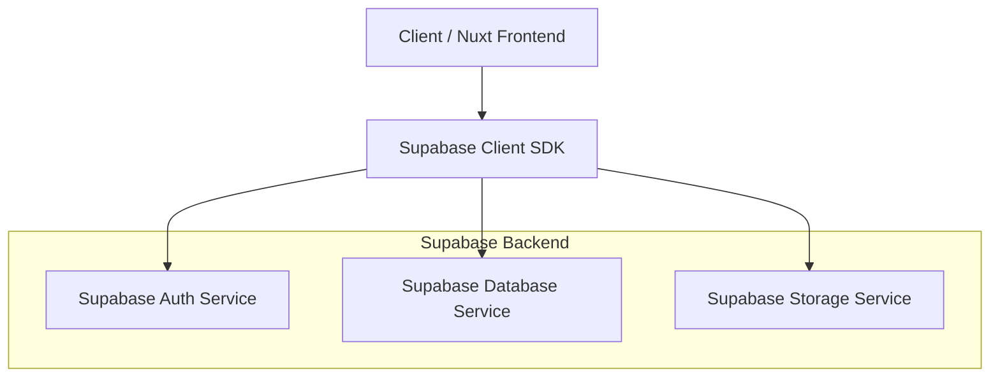
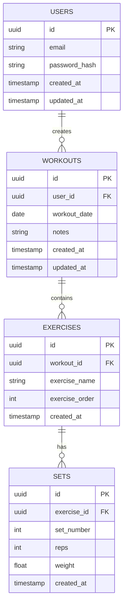

## 1. Architecture design



## 2. Technology Description
- Frontend: Nuxt 4 + TailwindCSS@3 + Vue@3
- Initialization Tool: npx nuxi@latest init
- Backend: Supabase (PostgreSQL + Auth + Storage)
- Database: PostgreSQL (via Supabase)
- Deployment: AWS (via GitHub Actions)

## 3. Route definitions
| Route | Purpose |
|-------|---------|
| / | Dashboard page, overview of recent workouts and stats |
| /login | Login page, user authentication |
| /register | Registration page, new user signup |
| /workout/new | New workout page, add exercises and sets |
| /workout/history | History page, view past workouts |
| /workout/progress | Progress page, charts and personal records |
| /profile | User profile page, account settings |

## 4. API definitions

### 4.1 Core API

**User authentication related**
```
POST /auth/v1/token
```

Request:
| Param Name| Param Type  | isRequired  | Description |
|-----------|-------------|-------------|-------------|
| email     | string      | true        | User email address |
| password  | string      | true        | User password |

Response:
| Param Name| Param Type  | Description |
|-----------|-------------|-------------|
| access_token | string  | JWT access token |
| refresh_token | string | JWT refresh token |
| user      | object      | User data object |

**Workout data related**
```
GET /rest/v1/workouts
POST /rest/v1/workouts
PUT /rest/v1/workouts
DELETE /rest/v1/workouts
```

## 5. Server architecture diagram



## 6. Data model

### 6.1 Data model definition


### 6.2 Data Definition Language

**Users Table**
```sql
-- create table
CREATE TABLE users (
    id UUID PRIMARY KEY DEFAULT gen_random_uuid(),
    email VARCHAR(255) UNIQUE NOT NULL,
    password_hash VARCHAR(255) NOT NULL,
    created_at TIMESTAMP WITH TIME ZONE DEFAULT NOW(),
    updated_at TIMESTAMP WITH TIME ZONE DEFAULT NOW()
);

-- grant permissions
GRANT SELECT ON users TO anon;
GRANT ALL ON users TO authenticated;
```

**Workouts Table**
```sql
-- create table
CREATE TABLE workouts (
    id UUID PRIMARY KEY DEFAULT gen_random_uuid(),
    user_id UUID REFERENCES auth.users(id) ON DELETE CASCADE,
    workout_date DATE NOT NULL,
    notes TEXT,
    created_at TIMESTAMP WITH TIME ZONE DEFAULT NOW(),
    updated_at TIMESTAMP WITH TIME ZONE DEFAULT NOW()
);

-- grant permissions
GRANT SELECT ON workouts TO anon;
GRANT ALL ON workouts TO authenticated;

-- create policies
CREATE POLICY "Users can view own workouts" ON workouts
    FOR SELECT USING (auth.uid() = user_id);

CREATE POLICY "Users can insert own workouts" ON workouts
    FOR INSERT WITH CHECK (auth.uid() = user_id);

CREATE POLICY "Users can update own workouts" ON workouts
    FOR UPDATE USING (auth.uid() = user_id);

CREATE POLICY "Users can delete own workouts" ON workouts
    FOR DELETE USING (auth.uid() = user_id);
```

**Exercises Table**
```sql
-- create table
CREATE TABLE exercises (
    id UUID PRIMARY KEY DEFAULT gen_random_uuid(),
    workout_id UUID REFERENCES workouts(id) ON DELETE CASCADE,
    exercise_name VARCHAR(100) NOT NULL,
    exercise_order INTEGER DEFAULT 0,
    created_at TIMESTAMP WITH TIME ZONE DEFAULT NOW()
);

-- grant permissions
GRANT SELECT ON exercises TO anon;
GRANT ALL ON exercises TO authenticated;

-- create policies
CREATE POLICY "Users can view own exercises" ON exercises
    FOR SELECT USING (auth.uid() IN (SELECT user_id FROM workouts WHERE id = workout_id));

CREATE POLICY "Users can insert own exercises" ON exercises
    FOR INSERT WITH CHECK (auth.uid() IN (SELECT user_id FROM workouts WHERE id = workout_id));
```

**Sets Table**
```sql
-- create table
CREATE TABLE sets (
    id UUID PRIMARY KEY DEFAULT gen_random_uuid(),
    exercise_id UUID REFERENCES exercises(id) ON DELETE CASCADE,
    set_number INTEGER NOT NULL,
    reps INTEGER NOT NULL,
    weight DECIMAL(10,2) NOT NULL,
    created_at TIMESTAMP WITH TIME ZONE DEFAULT NOW()
);

-- grant permissions
GRANT SELECT ON sets TO anon;
GRANT ALL ON sets TO authenticated;

-- create policies
CREATE POLICY "Users can view own sets" ON sets
    FOR SELECT USING (auth.uid() IN (
        SELECT w.user_id FROM workouts w 
        JOIN exercises e ON w.id = e.workout_id 
        WHERE e.id = exercise_id
    ));

CREATE POLICY "Users can insert own sets" ON sets
    FOR INSERT WITH CHECK (auth.uid() IN (
        SELECT w.user_id FROM workouts w 
        JOIN exercises e ON w.id = e.workout_id 
        WHERE e.id = exercise_id
    ));
```

**AWS Deployment Configuration**
```yaml
# .github/workflows/deploy.yml
name: Deploy to AWS

on:
  push:
    branches: [ main ]

jobs:
  deploy:
    runs-on: ubuntu-latest
    
    steps:
    - uses: actions/checkout@v3
    
    - name: Setup Node.js
      uses: actions/setup-node@v3
      with:
        node-version: '18'
        
    - name: Install dependencies
      run: npm ci
      
    - name: Build application
      run: npm run build
      
    - name: Deploy to AWS
      run: |
        # AWS deployment commands here
        # Can use AWS CLI, Amplify, or other AWS services
```